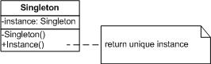

# 第一讲：php实现单例模式

###【概要】
创建型模式
保证一个类仅有一个实例，并且提供一个访问它的全局访问点【GOF95】

###【特点】
1、一个类只有一个实例  
2、它必须自行创建这个实例  
3、必须自行向整个系统提供这个实例  

###【结构图】  



###【主要角色】
Singleton 定义一个Instance操作，允许客户访问它的唯一实例。Instance是一个类方法。负责创建它的唯一的实例。

###【优缺点】
1、对唯一实例的受控访问  
2、缩小命名空间 单例模式是对全局变量的一种改进。它避免了那些存储唯一实例的全局变量污染命名空间  
3、允许对操作和表示的精华 单例类可以有子类。而且用这个扩展类的实例来配置一个应用是很容易的。你可以用你所需要的类的实例在运行时刻配置应用。  
4、允许可变数目的实例（多例模式）  
5、比类操作更灵活  

###【适用性】
1、当类只能有一个实例而且客户可以从一个众所周知的访问点访问它时。    
2、当这个唯一实例应该是通过子类化可扩展的。并且用户应该无需更改代码就能使用一个扩展的实例时。

###【单例模式php实例】

```php
<?php
 /**
 * 单例模式
 * -------------
 * @author 		zhaoxuejie <zxj198468@gmail.com>
 * @package 	design pattern 
 * @version 	v1.0 2011-12-14
 */
class Singleton {
	
	//私有静态成员变量，保存全局实例
	private static $instance = NULL;
	
	//私有构造方法，保证外界无法直接实例化
	private function __construct(){}
	
	//静态方法，返回此类唯一实例
	public static function getInstance(){
		if(!isset(self::$instance)){
			$c = __CLASS__;
			self::$instance = new $c;
		}
		return self::$instance;
	}
	
	//测试用方法
	public function info(){
		return 'ok';
	}
	
	//防止克隆
	public function __clone(){
		trigger_error('Clone is not allowed.', E_USER_ERROR);
	}
}
 
$s = Singleton::getInstance();
echo $s->info();
?>

```
----------

> 作者：陌阡  
> 来源：CSDN  
> 原文：https://blog.csdn.net/zhaoxuejie/article/details/7072802  
 > 版权声明：本文为博主原创文章，转载请附上博文链接！