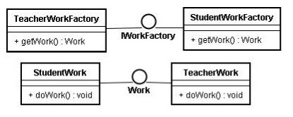

# 第二讲：php实现工厂模式

设计模式-使用php实现工厂方法模式

###【概要】  
创建型模式
定义一个用于创建对象的接口，让子类决定实例化哪一个类。Factory Method使用一个类的实例化延迟到其子类【GOF95】

###【结构图】



###【主要角色】  
抽象产品(Product)角色：具体产品对象共有的父类或接口  
具体产品(Concrete Product)角色：实现抽象产品角色所定义的接口，并且工厂方法模式所创建的每一个对象都是某具体产品对象的实例  
抽象工厂(Creator)角色：模式中任何创建对象的工厂类都要实现这个接口，它声明了工厂方法，该方法返回一个Product类型的对象。  
Creator也可以定义一个工厂方法的缺省实现，它返回一个缺省的的ConcreteProduct对象  
具体工厂(Concrete Creator)角色：实现抽象工厂接口，具体工厂角色与应用逻辑相关，由应用程序直接调用以创建产品对象。  

###【优缺点】  
优点：工厂方法模式可以允许系统在不修改工厂角色的情况下引进新产品。  
缺点：客户可能仅仅为了创建一个特定的ConcreteProduct对象，就不得不创建一个Creator子类

###【适用性】  
1、当一个类不知道它所必须创建的对象的类的时候  
2、当一个类希望由它的子类来指定它所创建的对象的时候  
3、当类将创建对象的职责委托给多个帮助子类的某一个，并且你希望将哪一个帮助子类是代理者这一信息局部化的时候  

###【工厂模式php实例】

```php
<?php
 /**
 * 工厂方法模式
 * -------------
 * @author 		zhaoxuejie <zxj198468@gmail.com>
 * @package 	design pattern 
 * @version 	v1.0 2011-12-14
 */
 
//抽象产品
interface Work {
	public function doWork(); 
}
 
//具体产品实现
class Student implements Work {
	
	function doWork(){
		echo "学生做作业！\n";
	}
}
 
class Teacher implements Work {
	
	function doWork(){
		echo "老师批改作业！\n";
	}
}
 
//抽象工厂
interface WorkerFactory {
	public function getWorker();
}
 
//具体抽象工厂实现
class StudentFactory {
	
	function getWorker(){
		return new Student();
	}
}
 
class TeacherFactory {
	function getWorker(){
		return new Teacher();
	}
}
 
//客户端
class Client {
	
	static function main() {
		$s = new Student();
		$s->doWork();
		
		$t = new Teacher();
		$t->doWork();
	}
}
 
Client::main();
?>

```
----------

> 作者：陌阡  
> 来源：CSDN  
> 原文：https://blog.csdn.net/zhaoxuejie/article/details/7072802  
 > 版权声明：本文为博主原创文章，转载请附上博文链接！