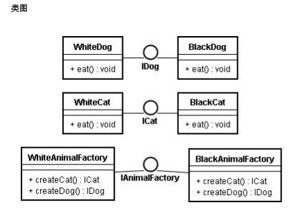

# 第三讲：php实现抽象工厂模式

设计模式-使用php实现抽象工厂模式

###【概要】
创建型模式
抽象工厂模式提供一个创建一系统相关或相互依赖对象的接口，而无需指定它们具体的类【GOF95】

###【特点】
抽象工厂模式（Abstact Factory）是一种常见的软件设计模式。该模式为一个产品族提供了统一的创建接口。当需要这个产品族的某一系列的时候，可以为此系列的产品族创建一个具体的工厂类。


###【结构图】



###【主要角色】
抽象工厂(Abstract Factory)角色：它声明一个创建抽象产品对象的接口。通常以接口或抽象类实现，所有的具体工厂类必须实现这个接口或继承这个类。  
具体工厂(Concrete Factory)角色：实现创建产品对象的操作。客户端直接调用这个角色创建产品的实例。这个角色包含有选择合适的产品对象的逻辑。通常使用具体类实现。  
抽象产品(Abstract Product)角色：声明一类产品的接口。它是工厂方法模式所创建的对象的父类，或它们共同拥有的接口。  
具体产品(Concrete Product)角色：实现抽象产品角色所定义的接口，定义一个将被相应的具体工厂创建的产品对象。其内部包含了应用程序的业务逻辑。  

###【优缺点】
抽象工厂模式的优点:  
1、分离了具体的类  
2、使增加或替换产品族变得容易  
3、有利于产品的一致性  

抽象工厂模式的缺点:  
难以支持新种类的产品。这是因为AbstractFactory接口确定了可以被创建的产品集合。支持新各类的产品就需要扩展访工厂接口，从而导致AbstractFactory类及其所有子类的改变。  
抽象工厂就是以一种倾斜的方式支持增加新的产品中，它为新产品族的增加提供了方便，而不能为新的产品等级结构的增加提供这样的方便。

###【适用性】
1、一个系统不应当依赖于产品类实例如何被创建、组合和表达的细节，这对于所有形态的工厂模式都是重要的。  
2、这个系统的产品有多于一个的产品族，而系统只消费其中某一族的产品。  
3、 同属于同一个产品族的产品是在一起使用的，这一约束必须在系统的设计中体现出来。  
4、系统提供一个产品类的库，所有的产品以同样的接口出现，从而使用客户端不依赖于实现  

###【抽象工厂模式php实例】

```php
<?php
 /**
 * 抽象工厂模式
 * -------------
 * @author 		zhaoxuejie <zxj198468@gmail.com>
 * @package 	design pattern 
 * @version 	v1.0 2011-12-14
 */
 
//抽象工厂
interface AnimalFactory {
	
	public function createCat();
	public function createDog();
	
}
 
//具体工厂
class BlackAnimalFactory implements AnimalFactory {
	
	function createCat(){
		return new BlackCat();
	}
	
	function createDog(){
		return new BlackDog();	
	}
}
 
class WhiteAnimalFactory implements AnimalFactory {
	
	function createCat(){
		return new WhiteCat();
	}
	
	function createDog(){
		return new WhiteDog();
	}
}
 
//抽象产品
interface Cat {
	function Voice();
}
 
interface Dog {
	function Voice();	
}
 
//具体产品
class BlackCat implements Cat {
	
	function Voice(){
		echo '黑猫喵喵……';
	}
}
 
class WhiteCat implements Cat {
	
	function Voice(){
		echo '白猫喵喵……';
	}
}
 
class BlackDog implements Dog {
	
	function Voice(){
		echo '黑狗汪汪……';		
	}
}
 
class WhiteDog implements Dog {
	
	function Voice(){
		echo '白狗汪汪……';		
	}
}
 
//客户端
class Client {
	
	public static function main() {
		self::run(new BlackAnimalFactory());
		self::run(new WhiteAnimalFactory());
	}
	
	public static function run(AnimalFactory $AnimalFactory){
		$cat = $AnimalFactory->createCat();
		$cat->Voice();
		
		$dog = $AnimalFactory->createDog();
		$dog->Voice();
	}
}
Client::main();
?>

```
----------

> 作者：陌阡  
> 来源：CSDN  
> 原文：https://blog.csdn.net/zhaoxuejie/article/details/7072802  
> 版权声明：本文为博主原创文章，转载请附上博文链接！