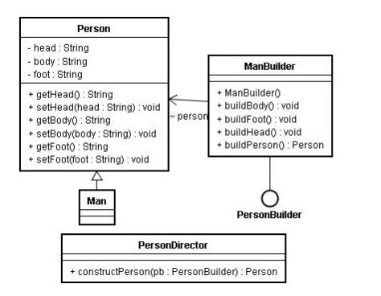

# 第四讲：php实现建造者模式

设计模式-使用php实现建造者模式

###【概要】
创建型模式
建造者模式可以让一个产品的内部表象和和产品的生产过程分离开，从而可以生成具有不同内部表象的产品。

###【结构图】



###【主要角色】
抽象建造者(Builder)角色:定义一个抽象接口，规范产品各个组成成分的建造（即规范具体建造者的方法实现）。其中所规范的方法中必须包括建造方法和结果返回方法  
具体建造者(ConcreteBuilder)角色:实现抽象建造者角色所定义的方法。具体建造者与业务逻辑关联性较大，应用程序最终会通过调用此角色中所实现的建造方法按照业务逻辑创建产品，在建造完成后通过结果返回方法返回建造的产品实例。一般在外部由客户或一个抽象工厂创建。  
导演者(Director)角色：此角色的作用是调用具体的建造者角色建造产品。导演者与产品类没有直接关系，与产品类交谈的是具体抽象角色。  
产品(Product)角色：在指导者的指导下由建造者所创建的那个复杂的对象  
导演者角色与客户端直接打交道，它理解客户端的业务逻辑，将客户端创建产品的请求拆分成对产品组成部分的请求，然后调用具体产品角色执行建造操作。它分离了客户端与具体建造者。

###【优缺点】
Builder模式的优点: 建造者模式可以很好的将一个对象的实现与相关的“业务”逻辑分离开来，从而可以在不改变事件逻辑的前提下,使增加(或改变)实现变得非常容易。  
Builder模式的缺点: 建造者接口的修改会导致所有执行类的修改。  

###【适用性】 
1、 需要生成的产品对象有复杂的内部结构。  
2、 需要生成的产品对象的属性相互依赖，建造者模式可以强迫生成顺序。  
3、 在对象创建过程中会使用到系统中的一些其它对象，这些对象在产品对象的创建过程中不易得到。  

###【建造者模式php实例】

```php
<?php
 /**
 * 建造者模式
 * -------------
 * @author 		zhaoxuejie <zxj198468@gmail.com>
 * @package 	design pattern 
 * @version 	v1.0 2011-12-14
 */
 
//product
class Person {
	private $head;
	private $body;
	private $foot;
	
	//头
	public function getHead(){
		return $this->head;
	}
	
	public function setHead($head){
		$this->head = $head;
	}
	
	//体
	public function getBody(){
		return $this->body;
	}
	
	public function setBody($body){
		$this->body = $body;
	}
	
	//脚
	public function getFoot(){
		return $this->foot;
	}
	
	public function setFoot($foot){
		$this->foot = $foot;
	}
}
 
//创建一个product对象的各个部件指定抽象接口
interface PersonBuilder {
	
	public function buildHead();
	public function buildBody();
	public function buildFoot();
	public function getResult();//产品返还方法
}
 
//实现接口
class ConcreteBuilder implements PersonBuilder {
	private $person;
	
	function __construct(){
		$this->person = new Person();	
	}
	
	function buildHead(){
		$this->person->setHead('建造头……');
	}
	
	function buildBody(){
		$this->person->setBody('建造身体……');
	}
	
	function buildFoot(){
		$this->person->setFoot('建造脚……');
	}
	
	function getResult(){
		return $this->person;
	}	
}
 
//指导者
class Director {
	
	public function __construct(ConcreteBuilder $builder){
		$builder->buildHead();
		$builder->buildBody();
		$builder->buildFoot();
	}
}
 
//客户端
class Client {
	
	public static function main(){
		$builder = new ConcreteBuilder();
		$director = new Director($builder);
		$person = $builder->getResult();
		echo $person->getHead();
		echo $person->getBody();
		echo $person->getFoot();
	}
}
 
Client::main();
 
?>

```

----------

> 作者：陌阡  
> 来源：CSDN  
> 原文：https://blog.csdn.net/zhaoxuejie/article/details/7072802  
 > 版权声明：本文为博主原创文章，转载请附上博文链接！