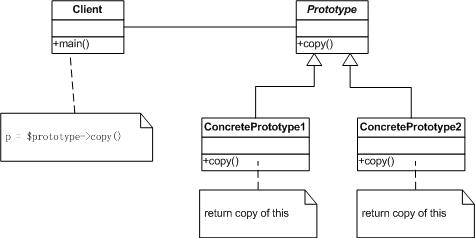

# 第五讲：php实现原型模式

设计模式-使用php实现原型模式

###【概要】
创建型模式
用原型实例指定创建对象的种类，并且通过拷贝这些原型创建新的对象

###【结构图】



###【主要角色】
抽象原型(Prototype)角色：声明一个克隆自身的接口  
具体原型(Concrete Prototype)角色：实现一个克隆自身的操作  

###【优缺点】
Prototype模式优点：  
1、可以在运行时刻增加和删除产品  
2、可以改变值以指定新对象  
3、可以改变结构以指定新对象  
4、减少子类的构造  
5、用类动态配置应用  
Prototype模式的缺点：  
Prototype模式的最主要缺点就是每一个类必须配备一个克隆方法。  
而且这个克隆方法需要对类的功能进行通盘考虑，这对全新的类来说不是很难，但对已有的类进行改造时，不一定是件容易的事。

###【适用性】
1、当一个系统应该独立于它的产品创建、构成和表示时，要使用Prototype模式  
2、当要实例化的类是在运行时刻指定时，例如动态加载  
3、为了避免创建一个与产品类层次平等的工厂类层次时；  
4、当一个类的实例只能有几个不同状态组合中的一种时。建立相应数目的原型并克隆它们可能比每次用合适的状态手工实例化该类更方便一些  

###【原型模式php实例】

```php
<?php
 /**
 * 原型模式
 * -------------
 * @author 		zhaoxuejie <zxj198468@gmail.com>
 * @package 	design pattern 
 * @version 	v1.0 2011-12-14
 */
 
//声明一个克隆自身的接口
interface Prototype {
	public function copy();	
}	
 
//实现一个克隆自身的操作
class ConcretePrototype implements Prototype {
	private $name;
	
	function __construct($name){
		$this->name = $name;
	}
	
	function getName(){
		return $this->name;
	}
	
	function setName($name){
		$this->name = $name;
	}
	
	//克隆
	function copy(){
		return clone $this;
	}
}
 
//客户端
class Client {
	
	public static function main(){
		
		$pro = new ConcretePrototype('prototype');
		$pro2 = $pro->copy();
		echo $pro->getName();
		echo $pro2->getName();
	} 
}
 
Client::main();
?>

```

----------

> 作者：陌阡  
> 来源：CSDN  
> 原文：https://blog.csdn.net/zhaoxuejie/article/details/7072802  
 > 版权声明：本文为博主原创文章，转载请附上博文链接！