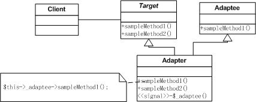

# 第六讲：php实现适配器模式

设计模式-使用php实现适配器模式

###【概要】  
结构型模式  
将一个类的接口转换成客户希望的另外一个接口。Adapter模式使得原来由于接口不兼容而不能一起工作的那此类可以一起工作【GOF95】

###【结构图】  



###【主要角色】  
目标(Target)角色：定义客户端使用的与特定领域相关的接口，这也就是我们所期待得到的  
源(Adaptee)角色：需要进行适配的接口  
适配器(Adapter)角色：对Adaptee的接口与Target接口进行适配；适配器是本模式的核心，适配器把源接口转换成目标接口，此角色为具体类  

###【适用性】  
1、你想使用一个已经存在的类，而它的接口不符合你的需求  
2、你想创建一个可以复用的类，该类可以与其他不相关的类或不可预见的类协同工作  
3、你想使用一个已经存在的子类，但是不可能对每一个都进行子类化以匹配它们的接口。对象适配器可以适配它的父类接口（仅限于对象适配器）  

###【适配器模式php实例】  

```php
<?php
 /**
 * 适配器模式
 * -------------
 * @author 		zhaoxuejie <zxj198468@gmail.com>
 * @package 	design pattern 
 * @version 	v1.0 2011-12-14
 */
 
//目标角色
interface Target {
	public function simpleMethod1();
	public function simpleMethod2();
}
 
//源角色
class Adaptee {
	
	public function simpleMethod1(){
		echo 'Adapter simpleMethod1';
	}
}
 
//类适配器角色
class Adapter implements Target {
	private $adaptee;
	
	
	function __construct(Adaptee $adaptee) {
		$this->adaptee = $adaptee; 
	}
	
	//委派调用Adaptee的sampleMethod1方法
	public function simpleMethod1(){
		echo $this->adaptee->simpleMethod1();
	}
	
	public function simpleMethod2(){
		echo 'Adapter simpleMethod2'; 	
	} 
	
}
 
//客户端
class Client {
	
	public static function main() {
		$adaptee = new Adaptee();
		$adapter = new Adapter($adaptee);
		$adapter->simpleMethod1();
		$adapter->simpleMethod2(); 
	}
}
 
Client::main();
 
?>

```

----------

> 作者：陌阡  
> 来源：CSDN  
> 原文：https://blog.csdn.net/zhaoxuejie/article/details/7072802  
 > 版权声明：本文为博主原创文章，转载请附上博文链接！